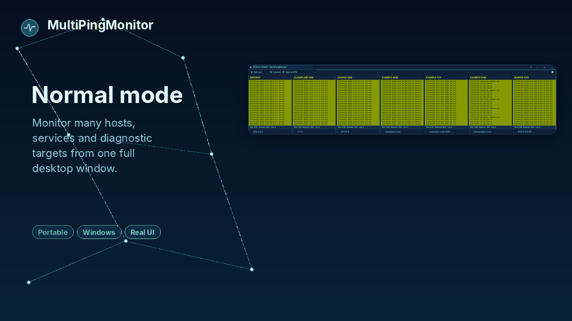
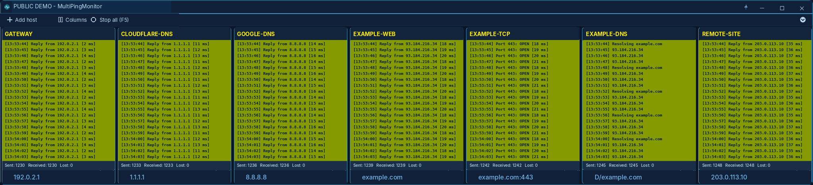
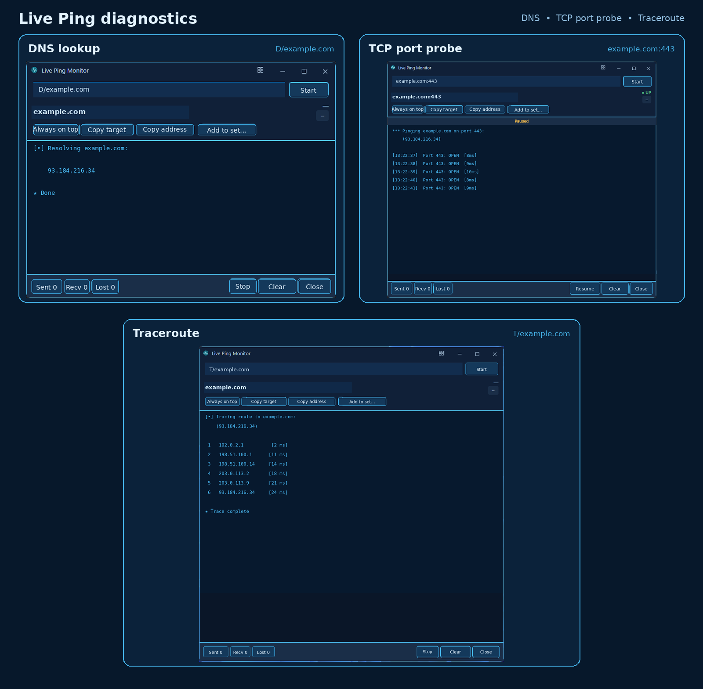
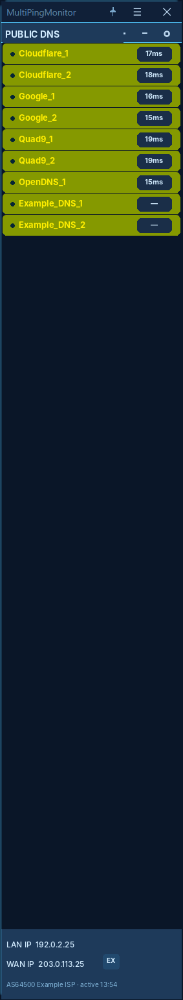

# MultiPingMonitor

**Know what is online, slow or unreachable — before it becomes a bigger problem.**

[](https://github.com/Vaso73/MultiPingMonitor/releases)
[](https://github.com/Vaso73/MultiPingMonitor/releases)
[](LICENSE)


[](https://github.com/sponsors/Vaso73)

<p align="center">
  <picture>
    <source srcset="docs/assets/readme/overview-demo.webp" type="image/webp">
    
  </picture>
</p>

<p align="center">
  <strong><a href="https://github.com/sponsors/Vaso73">Sponsor development &amp; get Sponsor Pro</a></strong>
  &nbsp;·&nbsp;
  <a href="https://github.com/Vaso73/MultiPingMonitor/releases/tag/v0.4.6">Try the Free edition</a>
  &nbsp;·&nbsp;
  <a href="#compare-editions">Compare editions</a>
  &nbsp;·&nbsp;
  <a href="https://github.com/Vaso73/MultiPingMonitor/issues">Report an issue</a>
</p>

<p align="center">
  <sub>Portable single EXE · No installer · Local configuration · Windows 10/11 · English fallback · External language packs in Sponsor Pro</sub>
</p>

Monitor hosts, TCP services, DNS resolution, and network routes from one
portable Windows application. No installer, no background service, and no
complicated setup.

MultiPingMonitor gives network administrators, infrastructure operators,
managed IT teams, and homelab users one place to see availability, latency,
status changes, and focused diagnostics.

## See problems sooner

- **See failures immediately.** Keep many hosts and services visible in one status view.
- **Watch the endpoints that matter.** Monitor ICMP, TCP ports, DNS resolution, and routes.
- **Diagnose without switching tools.** Open focused Live Ping windows for active investigation.
- **Keep critical services visible.** Use Compact Mode and reusable Compact Sets in Sponsor Pro.

<a id="compare-editions"></a>
## Compare editions

The **Free edition** is a stable, feature-frozen release for trying the core
multi-target monitoring workflow. Public Free releases currently end at
**v0.4.6**.

**Sponsor Pro** is the actively developed edition with current diagnostics,
compact workflows, Network Identity, private releases, and authorized in-app
updates.

| Capability | Free v0.4.6 | Sponsor Pro |
|---|:---:|:---:|
| Normal multi-target monitoring | ✅ | ✅ |
| ICMP, TCP, DNS, and traceroute probes | ✅ | ✅ |
| Favorites and aliases | ✅ | ✅ |
| Popup, audio, and email alerts | ✅ | ✅ |
| Status history and optional logging | ✅ | ✅ |
| Built-in themes | ✅ | ✅ |
| Live Ping diagnostic windows | — | ✅ |
| Compact Mode | — | ✅ |
| Reusable Compact Sets | — | ✅ |
| Network Identity | — | ✅ |
| External `.lang` language packs | — | ✅ |
| Current feature development | — | ✅ |
| Authorized in-app updates | — | ✅ |
| Private current releases | — | ✅ |

<p align="center">
  <strong><a href="https://github.com/sponsors/Vaso73">Get Sponsor Pro through GitHub Sponsors</a></strong>
  &nbsp;·&nbsp;
  <a href="https://github.com/Vaso73/MultiPingMonitor/releases/tag/v0.4.6">Download Free v0.4.6</a>
</p>

## Why Sponsor Pro?

Sponsor Pro is designed for users who want the current supported application
and more efficient day-to-day monitoring workflows:

- keep critical services visible without occupying the desktop;
- organize reusable monitoring groups with Compact Sets;
- investigate targets in independent Live Ping windows;
- see WAN/LAN identity and WAN-address changes through Network Identity;
- install authorized current releases from inside the application;
- support continued development and Windows compatibility work.

## Product tour

### Normal Mode

Monitor many hosts and services from one window with clear status, latency,
aliases, actions, and history.

<p align="center">
  
</p>

### Live Ping — Sponsor Pro

Open independent real-time diagnostic windows for selected targets. Multiple
windows can run simultaneously and provide latency, packet-loss counters,
pause/resume controls, always-on-top operation, and quick target actions.

<p align="center">
  
</p>

### Compact Mode — Sponsor Pro

Keep selected services visible in a narrow always-on-screen layout. Compact
Sets provide reusable target groups, ordering, start/stop control, and import
or export.

<p align="center">
  
</p>

## Quick start

### Free

1. Open the [v0.4.6 release](https://github.com/Vaso73/MultiPingMonitor/releases/tag/v0.4.6).
2. Download the release archive.
3. Extract it to a writable folder.
4. Run `MultiPingMonitor.exe`.

### Sponsor Pro

1. Join an eligible tier on [GitHub Sponsors](https://github.com/sponsors/Vaso73).
2. Complete GitHub authorization when requested.
3. Download the current private `MultiPingMonitor.zip`.
4. Extract it and run `MultiPingMonitor.exe`.
5. Install future authorized releases through the in-app updater.

No installer is required.

## Monitoring syntax

| Probe | Syntax | Example |
|---|---|---|
| ICMP | `host` or `IP` | `1.1.1.1` |
| TCP port | `host:port` or `IP:port` | `example.com:443` |
| DNS resolution | `D/host` | `D/example.com` |
| Traceroute | `T/host` or `T/IP` | `T/192.0.2.1` |

Additional controls include configurable interval, timeout, TTL, packet size,
flood-host testing, quick target actions, and focused monitoring windows.

Technical states include `UP`, `DOWN`, `ERROR`, `HIGH LATENCY`,
`INDETERMINATE`, and `INACTIVE`.

## Favorites, aliases, alerts, and history

Favorites save recurring monitoring groups for quick reuse. Aliases replace
technical hostnames or IP addresses with readable names.

MultiPingMonitor also supports:

- popup, audio, and email alerts;
- status history, filtering, export, and optional log files;
- Modern and Classic visual styles;
- built-in light and dark themes;
- automatic Windows light/dark theme selection;
- themed controls and status indicators.

## Network Identity — Sponsor Pro

Network Identity can display WAN and LAN addresses, provider, ASN, country,
lookup state, scheduled checks, and WAN-address change notifications. Address
values can be copied directly from the interface.

## Localization

English is built in as the fallback language.

Sponsor Pro supports external `.lang` files selected from Settings without
rebuilding the application. Language packs are stored in the `lang` directory
beside `MultiPingMonitor.exe`. The application can create the Slovak
`sk-SK.lang` seed while preserving user-edited text.

## Portable operation and updates

MultiPingMonitor runs from a normal writable folder and keeps its portable
configuration beside the executable.

The canonical Sponsor Pro package contains exactly one application file:

```text
MultiPingMonitor.exe
```

Authorized Sponsor Pro releases can be installed through the in-app updater.
The updater preserves portable configuration, restarts into the installed
version, and removes temporary update files after success.

The Free release channel remains available through public GitHub Releases.

## Desktop and command-line integration

The application supports notification-area operation, start minimized,
multi-monitor placement, and safe window restoration at common DPI settings.

MultiPingMonitor can also start with targets, input files, minimized operation,
and selected probe settings. The built-in **Usage** window contains the current
syntax and examples.

<details>
<summary><strong>Build from source</strong></summary>

Requirements:

- [.NET 8 SDK](https://dotnet.microsoft.com/download/dotnet/8.0)
- a Windows-capable .NET build environment

```bash
git clone https://github.com/Vaso73/MultiPingMonitor.git
cd MultiPingMonitor
dotnet restore MultiPingMonitor.sln
dotnet build MultiPingMonitor.sln -c Release
dotnet test MultiPingMonitor.sln -c Release
```

Create the canonical portable Windows x64 executable:

```bash
dotnet publish MultiPingMonitor/MultiPingMonitor.csproj -c Release -p:PublishProfile=SingleFile
```

Expected output:

```text
MultiPingMonitor/bin/publish/single-file/MultiPingMonitor.exe
```

`FolderPublish.pubxml` is intended only for development diagnostics.

</details>

## Support continued development

Sponsorship funds continued work on monitoring, diagnostics, Compact Mode,
localization, updater reliability, and Windows display compatibility. Eligible
tiers receive access to current Sponsor Pro builds.

<p align="center">
  <strong><a href="https://github.com/sponsors/Vaso73">Support development &amp; get Sponsor Pro</a></strong>
</p>

## License

See [LICENSE](LICENSE).

## Attribution

MultiPingMonitor is derived from
[vmPing](https://github.com/r-smith/vmPing) by
[Ryan Smith](https://github.com/r-smith), originally released under the MIT
License.
